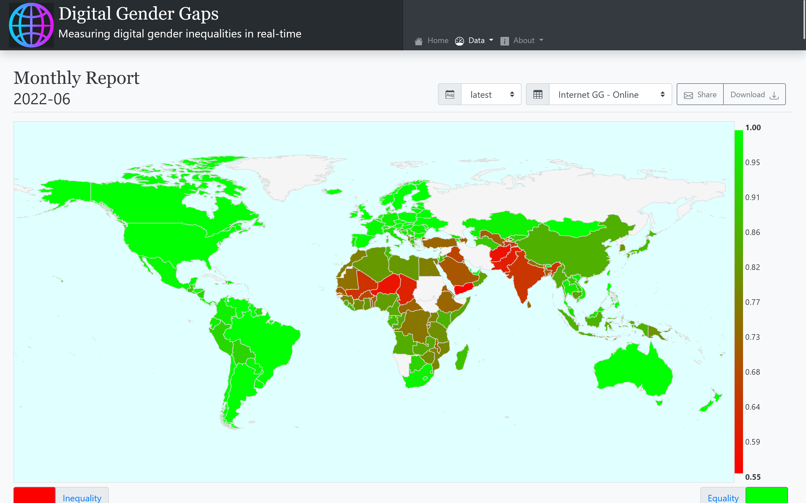

# digital-gender-gaps.dashboard

A Play Framework website for data visualisation. Customized from https://github.com/ianknowles/graphing-server-core for 
to show changes to gender differences in internet access.

The build supports Scala.js for frontend scripting, slick for database access, and scss compilation.

The project can be compiled with sbt, and produces a .deb install archive. This installs the webserver as a service that
requires a reverse-proxy such as nginx to be served on port 80 to the web.

No licenses are provided to redistribute the code, please contact the authors for a license if you wish to do so.
The core dashboard platform will be freely available shortly.

## Development environment
See [development.md](docs/development.md) for instructions on setting up a local development environment.
